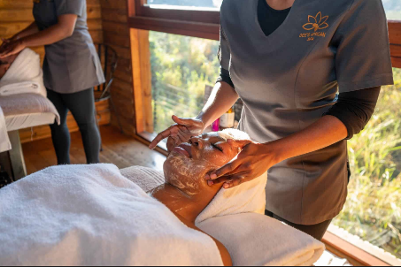
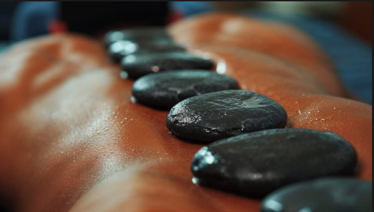

# Pabii's Retreat - Web Development Project Proposal

## Student Information
- **Full Name:** Paballo Mary Mokoena
- **Student Number:** ST10501151
- **Module:** Web Development (DNM0601)
- **Group:** Group One
---

## Project Overview
Pabii's Retreat is a wellness sanctuary established in July 2026 to deliver therapeutic services (such as hot stone therapy, facial treatments, and massages) aimed at stress relief, physical recovery, and mental relaxation in an affordable and serene environment.

---
## Website Goals and Objectives
* **Goal 1:** Provide affordable, high-quality therapeutic services to motivate clients to prioritize physical and mental wellness.
* **Goal 2:** Establish an online presence to transition customer reach beyond word-of-mouth and WhatsApp into a professional web solution.
* **Objective 1:** Build a responsive, user-friendly website featuring intuitive navigation across all main pages.
* **Objective 2:** Enable interactive service enquiries, spa package bookings, and direct contact options for potential clients.

---
# Key Features and Functionality
* **Multi-Page Structure:** Dedicated pages for Home, About Us, Services, Packages, Gallery, Customer Reviews, Enquiries, and Contact Us.
* **Responsive Layout:** Adaptive desktop, tablet, and mobile layouts built using Flexbox, CSS Grid, and media queries.
* **Interactive Forms:** Functional enquiry form with deposit/booking policy details and a direct contact form.
* **CSS Visual Styling:** Modern aesthetic featuring a custom color scheme, typography scales, pseudo-classes (`:hover`, `:focus`, `:active`), and layout structures.
---
## Timeline and Milestones
- **Phase 1:** Research, Sitemap Planning, and Proposal Submission.
- **Phase 2:** HTML Structure Implementation and GitHub Version Control.
- **Phase 3:** CSS Styling, Responsive Design, and Testing.

---
## Sitemap
- **Homepage:** `index.html`
- **About Us:** `about.html`
- **Services:** `services.html`
- **Packages:** `packages.html`
- **Gallery:** `gallery.html`
- **Enquiry:** `enquiry.html`
- **Contact Us:** `contact.html`
- **Reviews:** `reviews.html

---
## Part 1 Details
- Initial Sitemap creation and content research complete.
- Basic HTML structure set up across main pages.
- Repository set up and initial files committed.

---

## Part 2 Details (CSS & Responsive Design)
* **External Stylesheet:** Styled using `css/style.css` with baseline typography, custom color palette, and CSS reset rules.
* **Layout Techniques:** Flexible layout structures implemented using CSS Grid and Flexbox for multi-column alignment.
* **Breakpoints & Media Queries:** Customized media queries targeting desktop, tablet, and mobile viewports. 

### Responsive Design Evidence
* **Desktop View:**
  
* **Tablet View:**
  
* **Mobile View:**
  

---
### Part 1 Feedback Implementation & Corrections
* **[Insert Date]:** **HTML File Paths** — Corrected file naming and relative link paths across all navigation menus to ensure seamless page transitions.
* **[Insert Date]:** **Semantic Markup** — Updated HTML structure to include semantic layout elements (`<header>`, `<nav>`, `<main>`, `<section>`, `<footer>`).
* **[Insert Date]:** **Form Controls** — Added input validation and explicit field labels to both the Enquiry form (`enquiry.html`) and Contact form (`contactus.html`).

### Part 2 Feature Additions (CSS & Responsive Design)
* **[Insert Date]:** **Stylesheet Integration** — Created external stylesheet `css/style.css` and linked all pages.
* **[Insert Date]:** **Base Styling & Typography** — Defined typography scaling (`rem`/`em`), baseline margins, paddings, and CSS resets.
* **[Insert Date]:** **Layout Implementation** — Built multi-column card layouts using Flexbox and CSS Grid for desktop screens.
* **[Insert Date]:** **Media Queries** — Added responsive breakpoints converting desktop grid layouts into single-column flows for tablet and mobile devices.
* **[Insert Date]:** **Interactive States** — Added hover and active focus states to buttons, navigation elements, and form inputs.

---

## References
* American Massage Therapy Association (AMTA). 2024. *Massage Therapy Research and Consumer Information*. Available at: https://www.amtamassage.org/ (Accessed 25 July 2026).
* Creative Commons. 2026. *Sharing Openly, Sharing Globally*. Available at: https://creativecommons.org/ (Accessed 02 August 2026).
* Creative Commons. 2026. *Attribution*. Available at: https://creativecommons.org/licenses/ (Accessed 02 August 2026).
* Sharpsheets. 2026. *SWOT Analysis for a Massage Therapy Business*. Available at: https://sharpsheets.io/blog/swot-analysis-massage-therapy-business/ (Accessed 25 July 2026).
* World Health Organization (WHO). 2026. *Self-care for Health and Well-being*. Available at: https://www.who.int/ (Accessed 02 August 2026).
